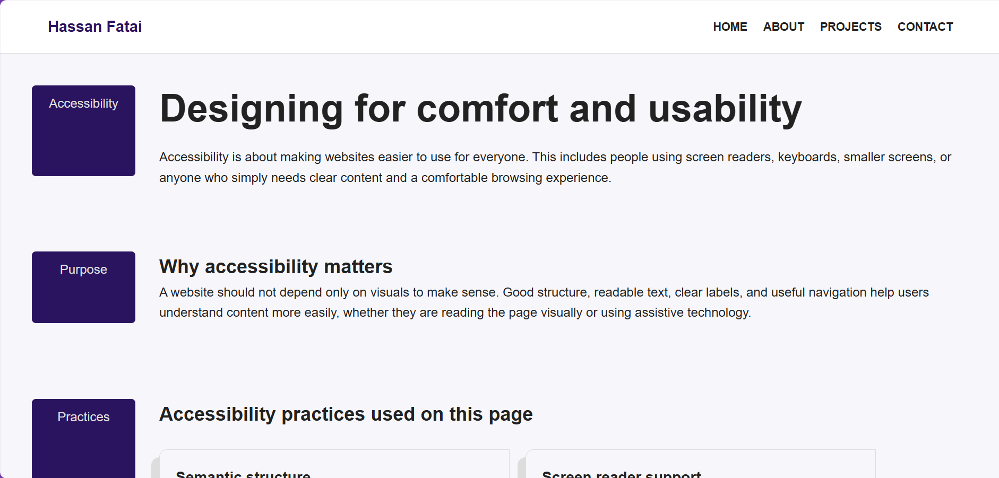
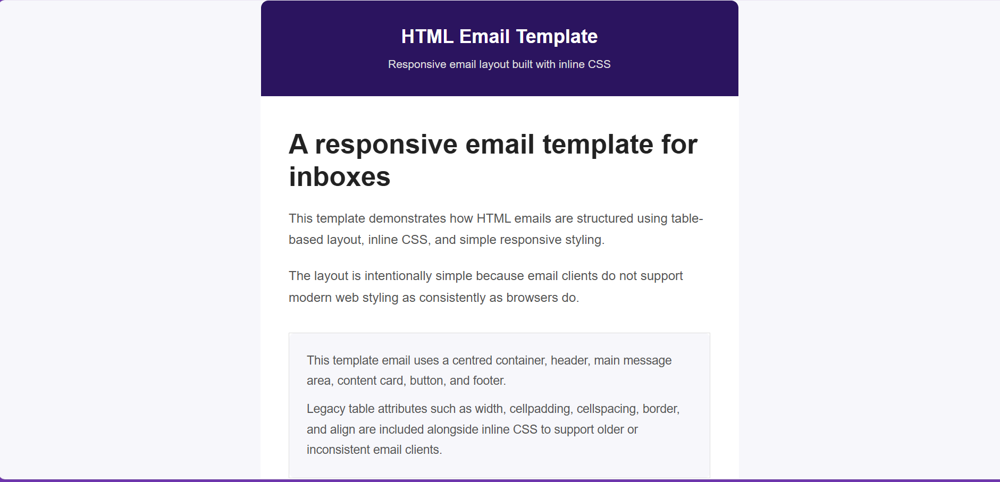
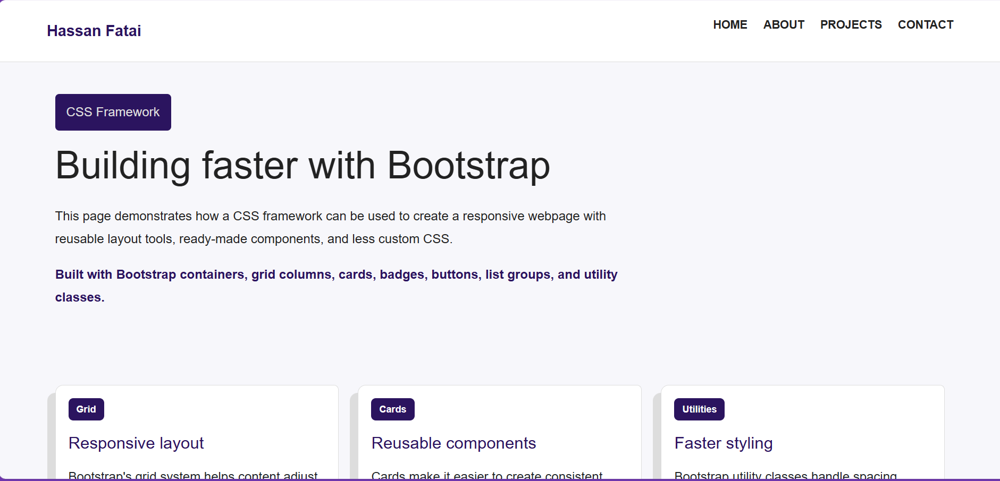
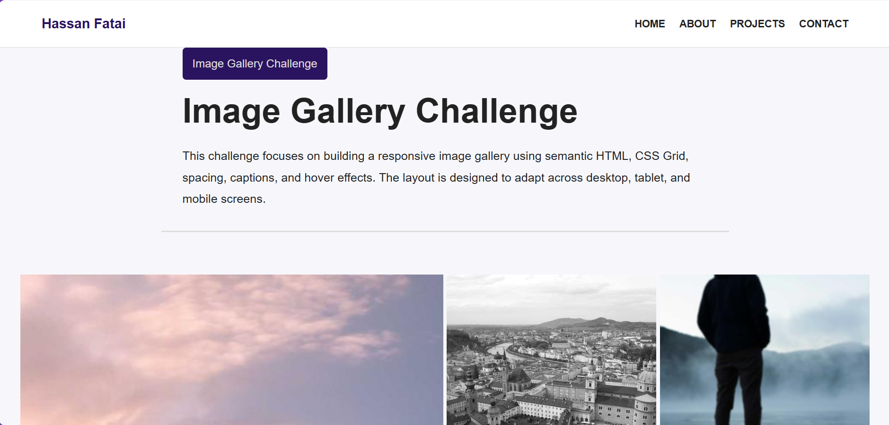
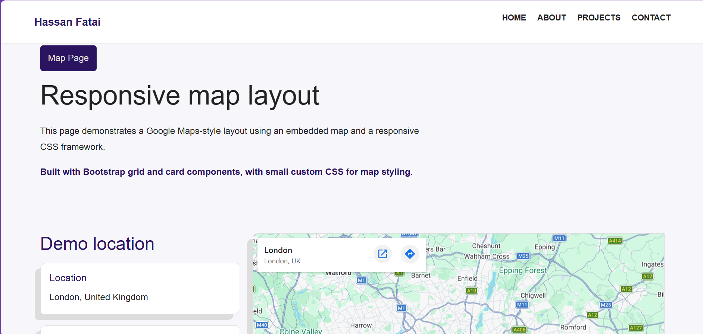
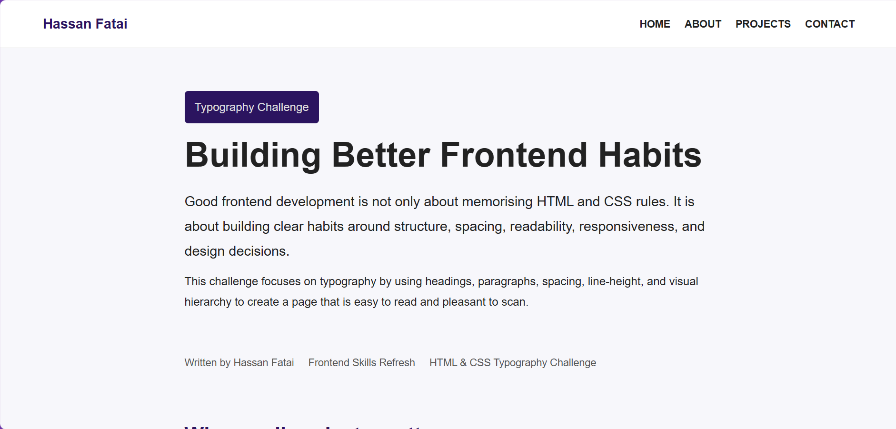
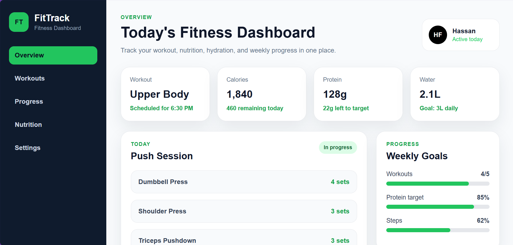

# Frontend HTML & CSS Challenges

A responsive HTML and CSS challenge portfolio built to refresh frontend fundamentals and document practical layout/design skills.

Live site: [Frontend HTML & CSS Challenges](https://frontend-html-css-challenges.vercel.app)

---

## Project Overview

This project is a collection of HTML and CSS challenge pages. Each page focuses on a different frontend skill, including layouts, responsive design, accessibility, Bootstrap, embedded maps, email templates, typography, and web app UI design.

---

## Overall Skills Used

- HTML5
- CSS3
- Responsive design
- Flexbox
- CSS Grid layout
- Media queries
- Accessibility basics
- Bootstrap
- HTML email layout
- Inline CSS
- Embedded iframe content

---

## Project Pages

### Accessibility Page



A page focused on accessibility basics, including readable structure, form labels, and visible focus states.

**Skills used:**

- Semantic HTML
- Accessible forms
- Focus states
- Responsive layout

---

### HTML Email Template



A responsive email template built with table layout, inline CSS, and email-friendly HTML structure.

**Skills used:**

- HTML tables
- Inline CSS
- Responsive email layout
- Email compatibility

---

### CSS Framework Page



A responsive page built with Bootstrap components and layout utilities.

**Skills used:**

- Bootstrap
- Responsive grid
- Cards
- Utility classes

---

### Image Gallery



A responsive image gallery built to practise image layout and spacing.

**Skills used:**

- CSS Grid layout
- Responsive images
- Spacing
- Media queries

---

### Map Page



A responsive map layout using an embedded Google Map and supporting location content.

**Skills used:**

- Bootstrap layout
- Google Maps embed
- Iframe
- Responsive design

---

### Image to HTML Mockup


A visual mockup recreated as a responsive HTML and CSS page.

**Skills used:**

- HTML structure
- Custom CSS
- Background images
- Responsive layout

---

### Typography Page



A page focused on text styling, spacing, and visual hierarchy.

**Skills used:**

- Typography
- Spacing
- Text hierarchy
- Responsive text layout

---

### Web Application UI



A responsive fitness dashboard interface designed as a web application screen.

**Skills used:**

- Dashboard layout
- CSS Grid layout
- Flexbox
- Responsive app UI

---

## Technologies Used

- HTML5
- CSS3
- Bootstrap 5
- Font Awesome
- Google Maps Embed
- Vercel

---

## Folder Structure

```text
.
├── imgs/
│   ├── accessibility-preview.png
│   ├── email-template-preview.png
│   ├── framework-preview.png
│   ├── image-gallery-preview.png
│   ├── image-to-html-preview.png
│   ├── map-layout-page.png
│   ├── typography-preview.png
│   └── ui-preview.png
├── about.html
├── accessibility.html
├── contact.html
├── email-template.html
├── framework.html
├── image-gallery.html
├── index.html
├── map.html
├── mockup.html
├── projects.html
├── typography.html
├── web-ui.html
├── mockup.css
├── style.css
├── web-ui.css
└── README.md
```